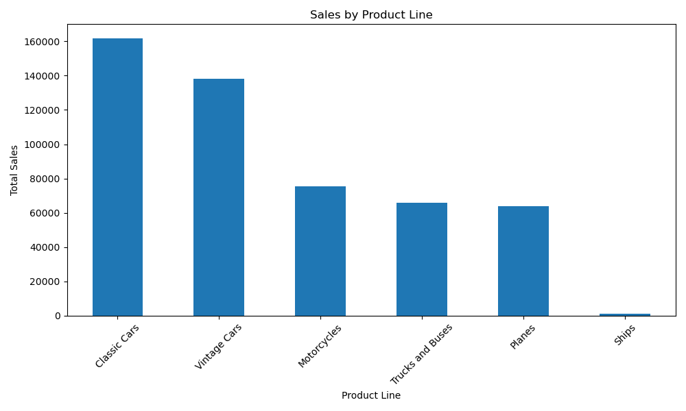

# Sales Data Analysis & Visualization

## Overview
This project focuses on cleaning, analyzing, and visualizing sales data using Python.

The goal is to transform raw data into meaningful insights that support data-driven decision-making.

---

## Tools & Technologies
- Python
- Pandas
- Matplotlib

---

## Data Cleaning
- Standardized column names
- Removed duplicate records
- Handled missing values efficiently
- Converted data types (dates and numeric values)
- Cleaned text fields

---

## Analysis & Visualization

### Sales by Product Line

### Top 10 Countries by Sales

### Monthly Sales Trend

---

## Key Insights
- Certain product lines generate the highest revenue
- Sales are concentrated in a few key countries
- Monthly trends show fluctuations that can support forecasting

---

## Project Structure
